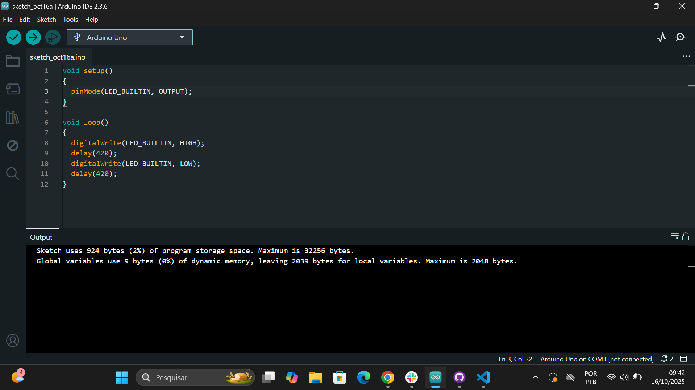
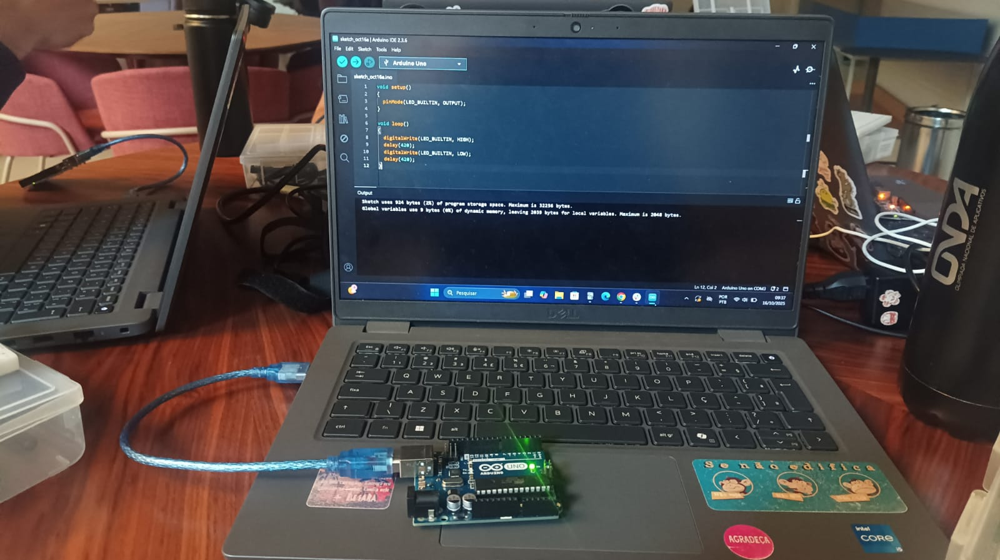
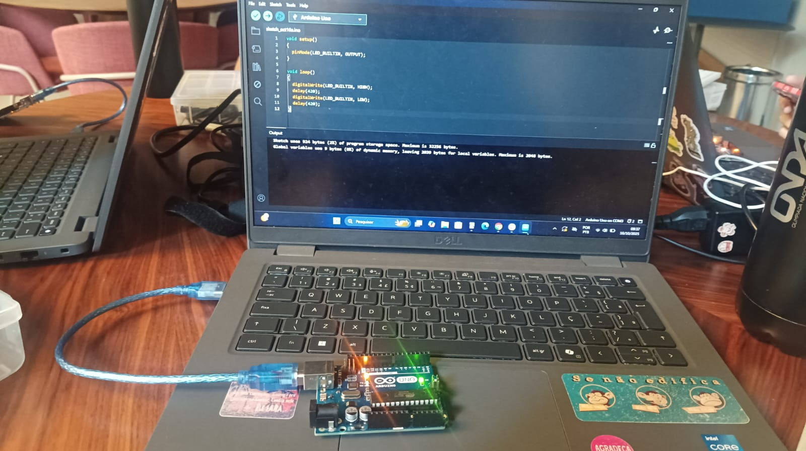

# Ponderada de programação - parte 1 - blink led interno

## Print do código e vídeo demonstrativo
&nbsp; &nbsp; &nbsp; &nbsp;A figura abaixo demonstra o código utilizado no Arduino IDE para o blink de led interno no arduino. Logo abaixo da figura 1, está o link com o vídeo demonstrativo do blink de led interno.

    
Figura 1 - Print do código da parte 1 da ponderada da semana 1

    
Fonte: material retirado do Arduino IDE pela autora (2025)

&nbsp; &nbsp; &nbsp; &nbsp;Link do vídeo demonstrativo do blink de led interno: [clique aqui](https://drive.google.com/file/d/1_XJjj8iPfArOvpaPrNibUAouSheaBltk/view?usp=sharing)

 

## Projeto funcionando
&nbsp; &nbsp; &nbsp; &nbsp;As figuras 2 e 3 apresentam, respectivamente, o led interno do arduino desligado e ligado.

    
Figura 2 - Foto do led interno do arduino desligado

    
Fonte: material produzido pela autora (2025).

   

    
Figura 3 - Foto do led interno do arduino ligado

    
Fonte: material produzido pela autora (2025).

   
