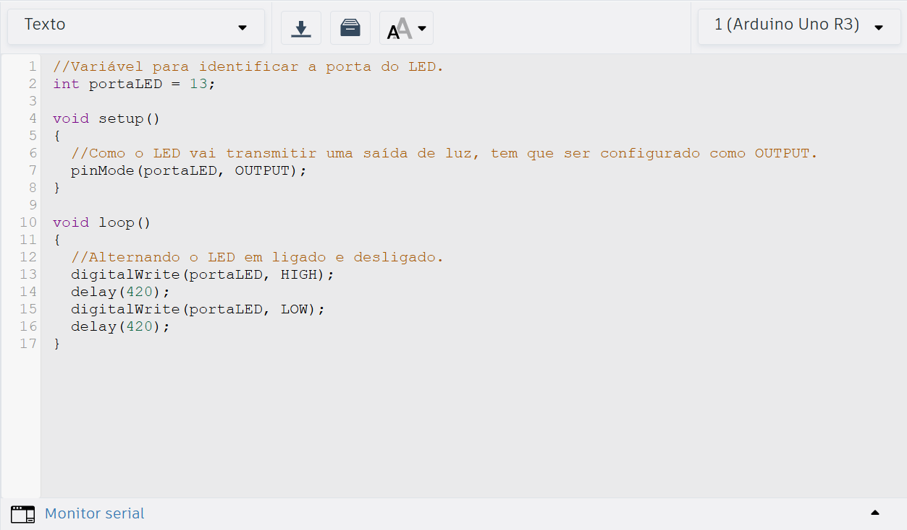
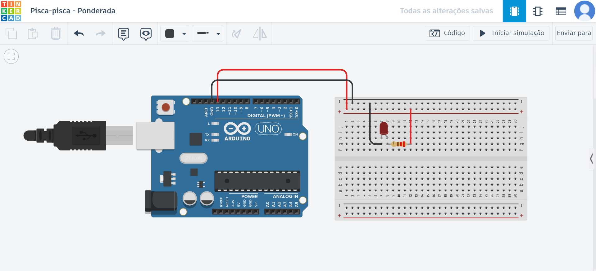
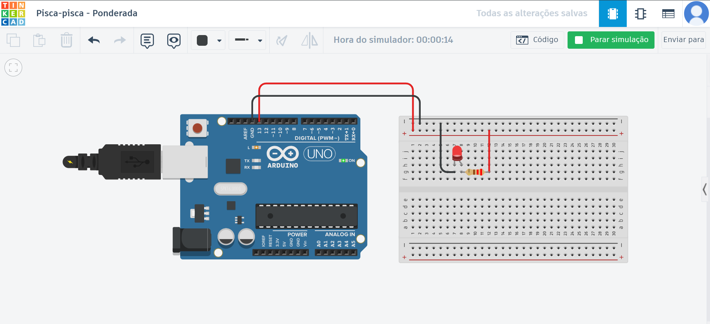

# Ponderada de programação - parte 2 - blink led externo
## Print do código
&nbsp; &nbsp; &nbsp; &nbsp;A figura abaixo apresenta o código que foi usado na simulação de blink com led externo no Tinkercad.

    
Figura 1 - Print do código da parte 2 da ponderada da semana 1

    
Fonte: material produzido pela autora no Tinkercad (2025).

## Projeto funcionando
&nbsp; &nbsp; &nbsp; &nbsp;A figura 2 contém o circuito do pisca-pisca montado. Basicamente, foi utilizado um LED vermelho, um resistor de 220 Ω, jumpers (vermelho corresponde ao positivo e o preto corresponde ao negativo), um arduino UNO, e uma protoboard.

    
Figura 2 - Circuito do pisca-pisca montado

    
Fonte: material produzido pela autora no Tinkercad (2025).

 

&nbsp; &nbsp; &nbsp; &nbsp;Já a figura 3 apresenta o funcionamento do pisca-pisca na simulação no Tinkercad. 

    
Fonte: material produzido pela autora no Tinkercad (2025).

 